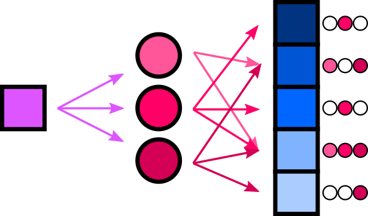

# Discovery

## Asymmetry
More favorites are yielded per query if going user-order rather than going post-order.

- User order: 300 favorites max per query
- Post order: 80 favorites max per query

This asymmetry, along with the fact that the favorites graph is sparse, means that it may be advantageous to use post-order to discover users for user-order.

## Single Core Post
Consider the case of a single post (the "core post") for which similar posts must be found. This requires sampling the favorites graph in a two-hop radius (core post -> bridge users -> branch posts).

For a single core post, using post-order sampling on the core post is a necessity. Bridge users are a small subset of all users, so if using user-order sampling, a large number of users would have to be sampled before having enough edges to be workable.

Doing reverse post-order sampling on branch posts would likewise yield users who are mostly uninvolved. As such reverse post-order is not sensible for a single core post scenario.
