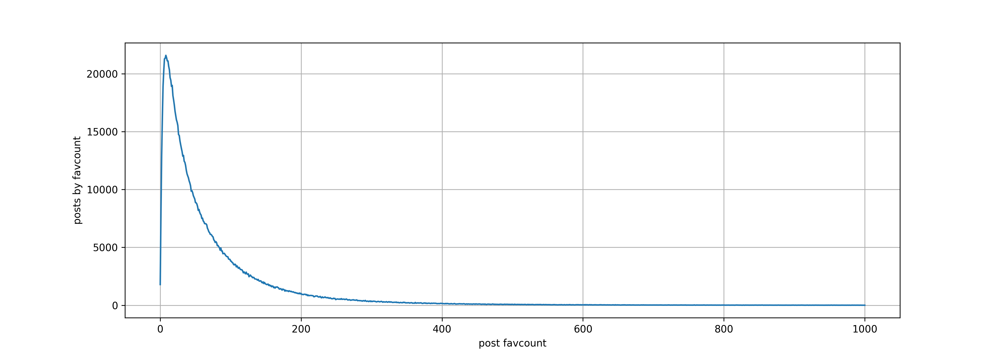
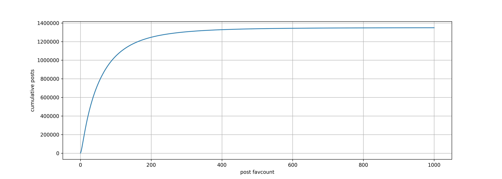
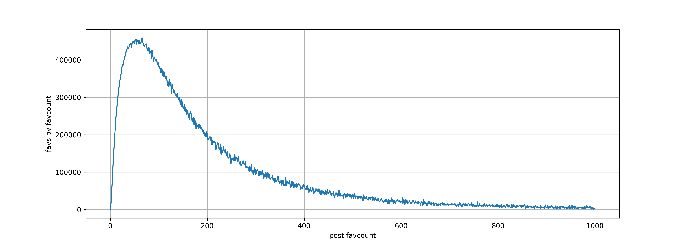
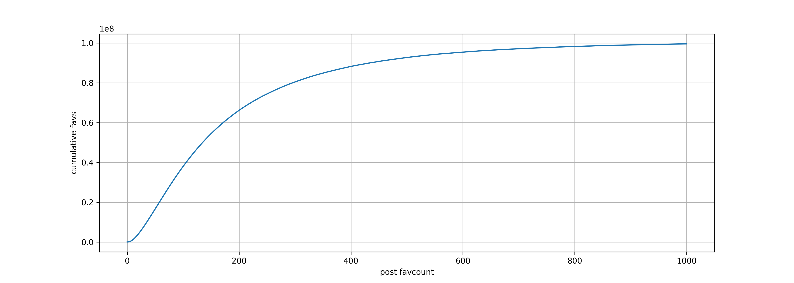
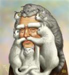

# Old Dataset: Aggregate Statistics

### Each post, binned by its own favcount

### Each favorite, binned into its post's favcount

# Old Dataset: Single Post's Details

This is a summary of the experiments done in [distributions.sql](distributions.sql).

Example numbers (old data), post 1893674 (smiling man with cats forming a beard):

- 40 favorites are recorded.
- These 40 users together have 503736 favorites.
- Each user had between 67000 and 37 total favorites
  - No obvious outliers in distribution of user favorite counts
- The majority (52%) of favorites were "alone", made on a post by one user in the group and no others

bin: n shared favorites | counts: posts with n shared favorites|
------- | ------
1 | 263328
2| 70452|
3| 19758|
4|  6009|
5|  1902|
 6|   645|
 7|   222|
 8|    86|
 9|    25|
10|    12|
11|     7|
12|     3|
13|     2|
14|     2|
20|     1|
40|     1|

- The post with most favorite overlap was the parent post, 59186.
  - It was favorited by 50% (20 of 40) of the users in the group

